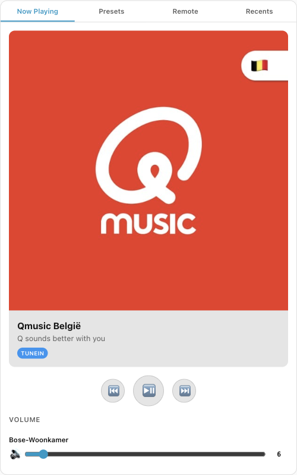
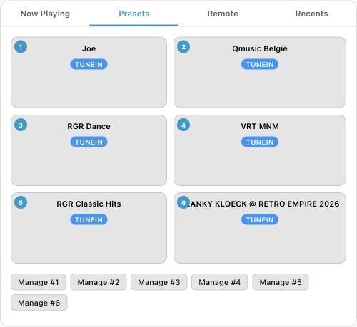
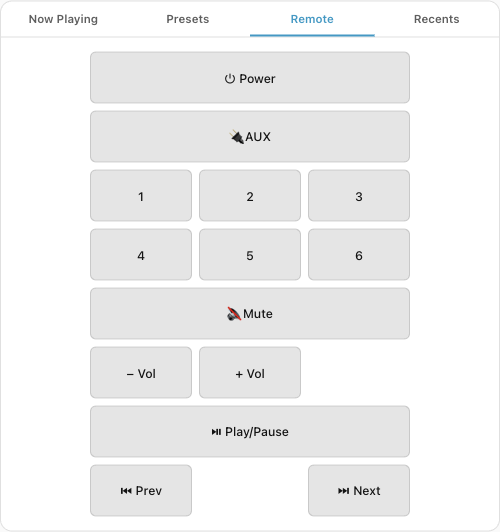
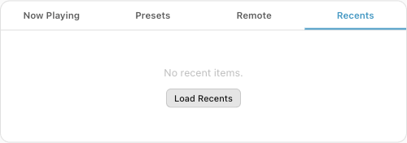

# SoundCork for Home Assistant

Home Assistant integration for [SoundCork](https://github.com/timvw/soundcork) — control your Bose SoundTouch speakers after the Bose cloud shutdown.

## What it does

- Creates `media_player` entities for each registered Bose SoundTouch speaker
- Real-time state updates via WebSocket (volume, now-playing, presets)
- Lovelace card with now-playing display, preset grid, remote control, and recents

All speaker communication is **proxied through the SoundCork server** — Home Assistant never needs direct LAN access to speakers.

## Screenshots

| Now Playing | Presets |
|:-----------:|:-------:|
|  |  |

| Remote | Recents |
|:------:|:-------:|
|  |  |

## Prerequisites

- [SoundCork](https://github.com/timvw/soundcork) running with speakers registered in the webui
- SoundCork with `/api/v1` router (included in main branch)
- Home Assistant 2024.1+

## Installation

### Via HACS (recommended)

1. Open HACS in Home Assistant
2. Click the three dots menu → **Custom repositories**
3. Add `https://github.com/timvw/soundcork-hass` as type **Integration**
4. Search for **SoundCork** and install
5. Restart Home Assistant

### Manual

Copy `custom_components/soundcork/` to your HA config directory:

```bash
cp -r custom_components/soundcork/ /path/to/ha-config/custom_components/soundcork/
```

Restart Home Assistant.

## Configuration

1. Go to **Settings → Devices & Services → Add Integration**
2. Search for **SoundCork**
3. Enter the SoundCork server URL

| Environment | URL |
|-------------|-----|
| K8s in-cluster | `http://soundcork.soundcork.svc.cluster.local:8000` |
| Same host | `http://localhost:8000` |
| LAN | `http://192.168.1.x:8000` |

The integration validates the connection by fetching the speaker list and creates entities automatically.

## Lovelace Card

The card is auto-registered when the integration loads — no manual resource step needed.

### Adding the card to a dashboard

HA 2024+ uses a sections-based dashboard layout. To add the SoundCork card, you need to edit the dashboard YAML directly:

1. Open the dashboard you want to add the card to
2. Click the **pencil icon** (top right) to enter edit mode
3. Click the **three dots** on a section → **Edit YAML** (or add a new section first)
4. Add the card to the `cards` list:

```yaml
type: grid
cards:
  - type: heading
    heading: SoundCork
  - type: custom:soundcork-card
    soundcork_url: https://your-soundcork-server.example.com
    speakers:
      - media_player.bose_woonkamer
```

Replace `soundcork_url` with your SoundCork server's **browser-reachable** URL, and `speakers` with your actual entity IDs (check **Settings → Devices & Services → SoundCork** for the entity names).

> **Important**: The `soundcork_url` must be reachable from your **browser**, not the HA pod. If HA and SoundCork run on the same k8s cluster, the integration uses the in-cluster URL, but the card needs the external URL.

### Multiple speakers

When multiple speakers are configured, the card shows speaker selector chips. Tap to toggle which speakers receive commands (play, volume, power). Multi-room playback uses the Bose zone API automatically.

```yaml
type: custom:soundcork-card
soundcork_url: https://soundcork.apps.example.com
speakers:
  - media_player.bose_woonkamer
  - media_player.bose_keuken
  - media_player.bose_slaapkamer
```

### Card tabs

| Tab | What it does |
|-----|-------------|
| **Now Playing** | Album art, track/artist info, source badge (TuneIn/Spotify/Radio), playback controls (prev/play-pause/next), per-speaker volume slider + mute |
| **Presets** | 2×3 grid of saved presets with station artwork. Tap to play. Manage buttons to edit presets (TuneIn search, internet radio URL, delete) |
| **Remote** | Button grid matching the SoundCork webui: Power, AUX, Presets 1-6, Mute, Vol ±, Play/Pause, Prev, Next |
| **Recents** | Recently played items with thumbnails and play buttons |

## Architecture

```
┌─────────────┐     REST /api/v1/*      ┌──────────────┐    port 8090    ┌──────────────┐
│   Home      │ ◄──────────────────────► │  SoundCork   │ ◄────────────► │ Bose Speaker │
│  Assistant  │     WS /api/v1/ws/*      │   Server     │    port 8080   │  (LAN)       │
└─────────────┘                          └──────────────┘                └──────────────┘
```

- **Integration** (runs in HA pod): Polls SoundCork REST API every 30s, maintains WebSocket connections through soundcork's proxy for real-time updates
- **Lovelace card** (runs in browser): Reads HA entity state for display, calls SoundCork API for commands and features not in entity state (presets, recents, remote keys)

## Entities

Each speaker creates a `media_player` entity with:

| Property | Source |
|----------|--------|
| State | playing / paused / buffering / off |
| Volume | 0.0–1.0 from speaker |
| Media title | Track name or station name |
| Media artist | Artist name |
| Media album | Album name |
| Media image | Album art URL |
| Source | Current preset name or source type |
| Source list | Preset names |

Extra attributes: `ip_address`, `device_id`, `source_type`, `preset_N_name`, `preset_N_source`

## Custom Services

| Service | Description |
|---------|-------------|
| `soundcork.play_preset` | Play preset 1–6 by number |
| `soundcork.store_preset_tunein` | Save a TuneIn station to a preset slot |
| `soundcork.store_preset_radio` | Save a direct stream URL to a preset slot |

## API Reference

The SoundCork server's `/api/v1` router exposes these endpoints (see [soundcork docs](https://github.com/timvw/soundcork/blob/main/docs/home-assistant.md) for details):

| Endpoint | Method | Description |
|----------|--------|-------------|
| `/api/v1/speakers` | GET | List speakers |
| `/api/v1/speakers/{ip}/now-playing` | GET | Playback state |
| `/api/v1/speakers/{ip}/volume` | GET/POST | Get/set volume |
| `/api/v1/speakers/{ip}/presets` | GET | Speaker presets |
| `/api/v1/speakers/{ip}/store-preset` | POST | Save preset |
| `/api/v1/speakers/{ip}/select` | POST | Play content item |
| `/api/v1/speakers/{ip}/key/{key}` | POST | Send remote key |
| `/api/v1/speakers/{ip}/power-on` | POST | Power on |
| `/api/v1/speakers/{ip}/power-off` | POST | Power off |
| `/api/v1/speakers/{ip}/recents` | GET | Recent items |
| `/api/v1/zone/set` | POST | Create multi-room zone |
| `/api/v1/zone/clear/{ip}` | POST | Dissolve zone |
| `/api/v1/tunein/search?q=` | GET | Search TuneIn |
| `/api/v1/ws/speaker/{ip}` | WS | Real-time updates |

## License

MIT
